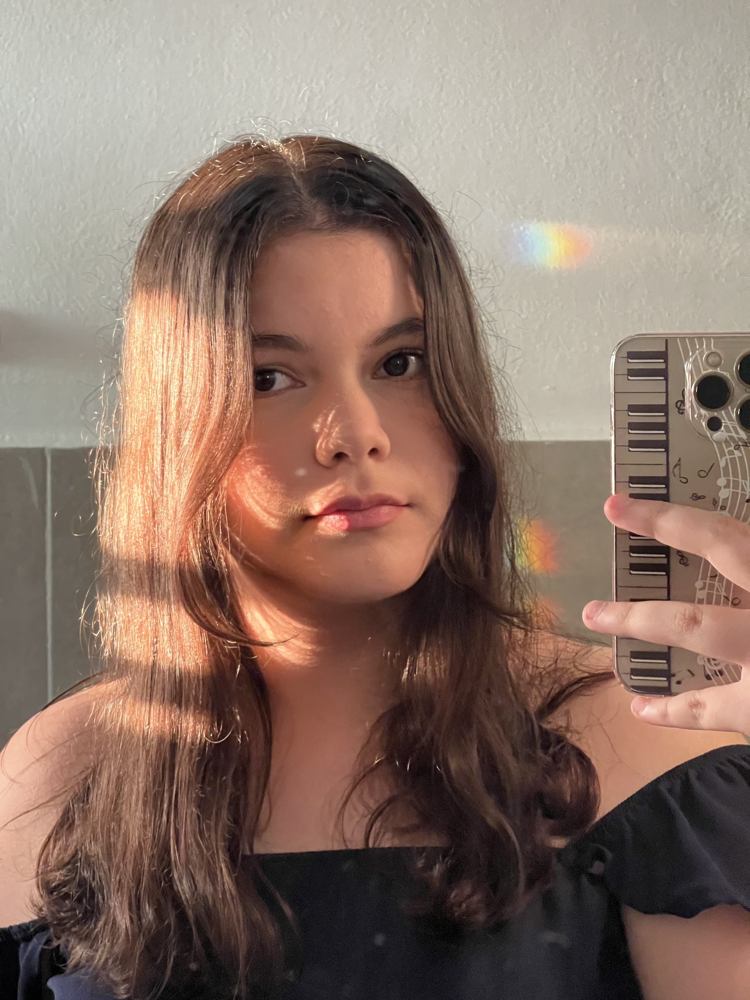
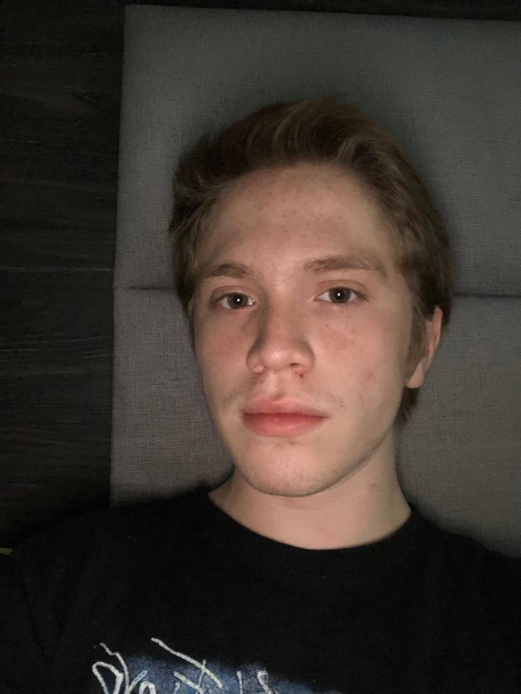
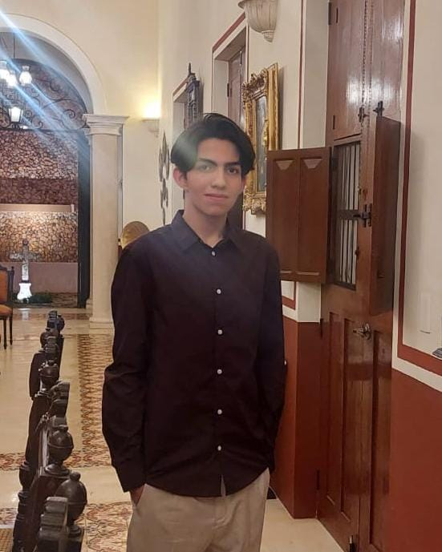

| Fotografía | Descripción | 
|:----------:|:-----------:|
| |¡Hola! Me llamo Daniela Villarino. Actualmente me encuentro estudiando la licenciatura en Ingeniería de Software. Me gusta la música, sé tocar algunos instrumentos musicales como el violín, el piano, el ukulele y la guitarra, junto con teoría musical; de igual manera, sé editar videos, tengo conocimientos de diseño de marcas y diseño gráfico, así como de HTML y CSS.|
|           |   Hola, mi nombre es Daniel Corona y estudio la Licenciatura de Ingeniería de Software en la Universidad Autónoma de Yucatán, donde resido. Me apasiona el arte y la música y toco la guitarra. Tengo conocimientos en la matemática pura y destreza con la solución de problemas lógicos. Igualmente, poseo habilidad para la organización dentro del trabajo en equipo.    |
||Hola, me llamo Axel. Estoy estudiando ingenería de software en la Facultad de Matemáticas de la Universidad Autónoma de Yucatán. Me gusta practicar karate, hacer deporte, estudiar matemáticas y explorar diferentes áreas del conocimiento relacionadas con la ingenería.             |
|         |      Soy una persona trabajadora, responsable y organizada. Se me da muy bien trabajar en equipo pues cuento con habilidades de comunicación que me permiten trabajar y ponerme de acuerdo más fácil con mis compañeros. Me considero extrovertido y por lo mismo no me gusta quedarme en mi zona de confort, me gusta ponerme a prueba y hacer cosas que sean un reto para mí.       |
| |  Hola, mi nombre es Rodrigo Farfán. Soy estudiante de la Licenciatura en Ingeniería de Software en la Universidad Autónoma de Yucatán. Me interesa formarme en el desarrollo web y poder seguir adquiriendo experiencia durante el transcurso de la carrera. Me gusta la música Gustavo Cerati y todo lo que sea sample music, el cine dónde se cuenten historias interesantes y en el fútbol soy aficionado del tiki-taka. |
| | Hola, mi nombre es Jefte Chunab. Estudiante de la Universidad Autonoma de Yucatán en la Facultad de Mátematicas en la cual me desarrollo en la licenciatura de Ingeniería de Software. Estoy interesado en aprender cosas nuevas acerca de software en todos los aspectos posibles, me gusta trabajar en equipo y apoyar a mis compañeros, mi deporte favorito es el voleibol y el hand ball por lo que trabajar en equipo es fundamental para mí. |

