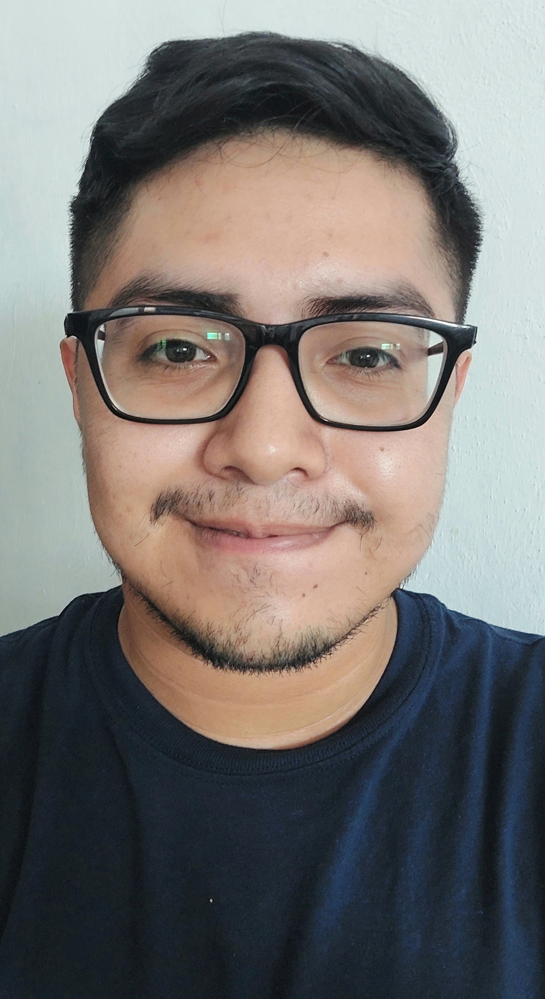

| Fotografía | Descripción | 
|:----------:|:-----------:|
| |¡Hola! Me llamo Daniela Villarino. Actualmente me encuentro estudiando la licenciatura en Ingeniería de Software. Me gusta la música, sé tocar algunos instrumentos musicales como el violín, el piano, el ukulele y la guitarra, junto con teoría musical; de igual manera, sé editar videos, tengo conocimientos de diseño de marcas y diseño gráfico, así como de HTML y CSS.|
|           |   Hola, mi nombre es Daniel Corona y estudio la Licenciatura de Ingeniería de Software en la Universidad Autónoma de Yucatán, donde resido. Me apasiona el arte y la música y toco la guitarra. Tengo conocimientos en la matemática pura y destreza con la solución de problemas lógicos. Igualmente, poseo habilidad para la organización dentro del trabajo en equipo.    |
|            |             |
| |  Hola, mi nombre es Rodrigo Farfán. Soy estudiante de la Licenciatura en Ingeniería de Software en la Universidad Autónoma de Yucatán. Me interesa formarme en el desarrollo web y poder seguir adquiriendo experiencia durante el transcurso de la carrera. Me gusta la música Gustavo Cerati y todo lo que sea sample music, el cine dónde se cuenten historias interesantes y en el fútbol soy aficionado del tiki-taka. |
|            |             |
|            |             |

