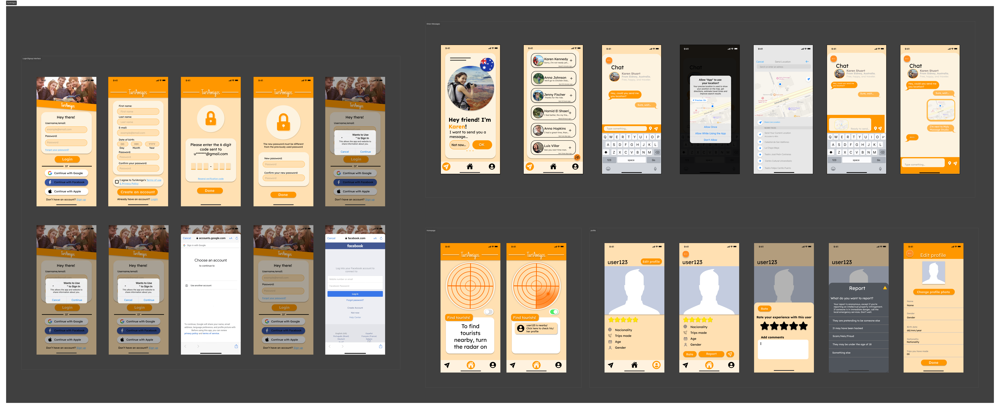

# Final prototype
The [final prototype](https://www.figma.com/proto/vD3boyCRpNkESRNN3f2BpO/TuriAmigos?page-id=102%3A2718&type=design&node-id=135-17123&viewport=996%2C723%2C0.13&t=9boLjpCNJUC8b9gQ-1&scaling=scale-down&starting-point-node-id=135%3A17123&mode=design) is a high fidelity one and was made using [Figma](https://www.figma.com). 

For this prototype, we used components and free wireframes that we found on figma's library to help keeping it easy for us. 

We wanted to make not only an aesthetically pleasing interface, but also an intuitive one, that's why we mainly used pastel colors for this prototype, and added simple things.

## Correspondency with the requirements
**_About the login interface:_**
> Requirement: 
>

This is the first interface that shows up when you open the app, you can login with not only an e-mail, but also with a Facebook, Google or even an iCloud account. 

**_About the homepage:_**
> Requirement:
>

The homepage interface is simple, it has the radar that can be activated when turning on a switch button. When the radar is on, the nearby users will show up right under it and by clicking it, you can go to the profile.

**_About the profile interface:_**
> Requirements:
>

The own profile interface is very simple, it shows a profile picture and some information about the users that they can modify anytime they want. There are also "rate", "message" and "report" buttons, and also an "edit profile" one to edit their own profile.

The repord interface was inspired by [Instagram](https://www.instagram.com)'s report interface, and the rating one was self-made.

**_About the messaging interface:_**

> Requirements:
>

The messaging interface has a library-based view as in any messaging app, for example we have [WhatsApp](https://web.whatsapp.com) and [Messenger](https://www.messenger.com). Moreover, the private chat includes a "send my location" function as a location button to establish a place to meet up.
