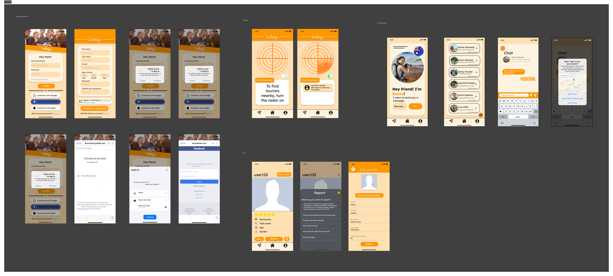

## Prototipo

El [prototipo creado](https://www.figma.com/proto/vD3boyCRpNkESRNN3f2BpO/TuriAmigos?type=design&node-id=135-17123&t=ZmUtvoP4SickNmvj-1&scaling=scale-down&page-id=102%3A2718&starting-point-node-id=135%3A17123&mode=design) es de alta fidelidad y fue creado utilizando la herramienta [Figma](https://www.figma.com). 

Para la creación de este prototipo, utilizamos varios componentes de wireframes gratuitos que encontramos en las librerías del mismo Figma para volver el desarrollo del prototipo más sencillo y práctico. Los wireframes también nos sirvieron para guiarnos en el sentido de la posición de cada componente en el caso de algún dispositivo IOS.

La intención del equipo era mantener una interfaz estéticamente agradable, sin colores demasiado vibrantes y/o brillosos, al igual que hacerla intuitiva y fácil de usar.

## Correspondencia con los requerimientos
**_Sobre la interfaz del Login:_** 

> Requerimiento: El login tendrá un botón para acceder por medio de una cuenta existente en Apple, Facebook o Google.

- Esta interfaz es la primera que se muestra al abrir la app, incluye las opciones para el login con Google, Apple y Facebook al estilo de botones.  

**_Sobre la interfaz del homepage:_**

> Requerimiento: Crear una interfaz capaz de mostrar al usuario un mapa con información sobre turistas cercanos a su zona en un radio limitado (a manera de radar, con una presentación similar a una app de gps).

- La interfaz del homepage de la app es sencilla, incluye el radar con la opción de activarlo y desactivarlo por medio de un botón estilo switch. Al activarse la opción del radar, aparecerán los usuarios cercanos en un recuadro justo debajo del radar, dando la opción de ver el perfil o simplemente ignorarlo.

**_Sobre la interfaz de perfiles:_**

> Requerimientos:
> - La aplicación tiene un sistema de perfiles editables para que los usuarios verifiquen la identidad de otros, asi como nacionalidad, numero de viajes, edad, genero.
> - A la aplicación se le añade la función de reportar a otros usuarios en caso de inconvenientes (robos, fraude, estafas, identidad falsa, etc.) para que su reporte sea gestionado y sean bloqueados de la aplicacion. Asimismo, existirá un sistema de calificaciones en base a estrellas y comentarios acerca de los usuarios de manera opcional.

La interfaz de perfiles es simple, muestra una foto de perfil junto con todas las especificaciones establecidas por el requerimiento, las cuales en la app son indicadas por el mismo usuario. En esta interfaz se encuentran botones establecidos para enviar mensaje directo al usuario, reportarlo, calificarlo y editar el perfil en caso de ser el perfil propio. 

Para la interfaz de reportes, se hizo inspirada en la de la red social [Instagram](https://www.instagram.com), siendo esta sencilla e intuitiva.

**_Sobre la interfaz de mensajería:_**

> Requerimientos:
> - La aplicación posee un sistema de mensajería privada para los turistas que se comuniquen a través de esta, que se utiliza para la organización de reuniones entre los usuarios para llevar a cabo actividades turísticas.
> - Se puede acceder a los  mensajes directos guardados en la libreria del usuario, similar a cualquier app de mensajeria.
> - La mensajería privada tendrá la posibilidad de que los usuarios puedan compartir su ubicación o alguna otra ubicacion con el propósito de establecer un punto de reunión.

En la interfaz de mensajería, se mantuvo un orden y una vista estilo librería como en cualquier app de mensajería, como ejemplos están [WhatsApp](https://web.whatsapp.com) y [Messenger](https://www.messenger.com).
 Además, el chat privado incluye la opción de enviar la ubicación al usuario por medio de un botón con el ícono de gps para poder establecer un punto de reunión entre ellos. 

## Validación de interfaces
Para la validación de las interfaces propuestas, se le envió el prototipo a compañeros nuestros y gente adulta, los cuales no tienen relación alguna con el proyecto. Se les solicitó amablemente que lo probaran como si fuese cualquier app, para después proceder a darles instrucciones específicas para hacer ciertas cosas, como enviarle una ubicación a algún chat o reportar algún perfil.

Después de realizar esta actividad, se le preguntó a los testers si cambiarían algo de la app y qué tan intuitiva era para ellos. A la gran mayoría se le facilitó el proceso de explorar el mismo prototipo, al igual que seguir las instrucciones específicas, por lo que sus comentarios fueron positivos, mencionaron que realmente es sencillo de utilizar y ententder, al igual que es agradable a la vista, sin embargo, hubo una sugerencia constante proveniente de personas con lentes:
>  La app tiene carencia de contraste de colores en algunas interfaces, especificando las letras, lo cual las hacía difícil de distinguir y leer.

Es por esto que se le agregó más saturación a algunos colores con la finalidad de dar un mejor contraste y facilitar el entendimiento de la app.
