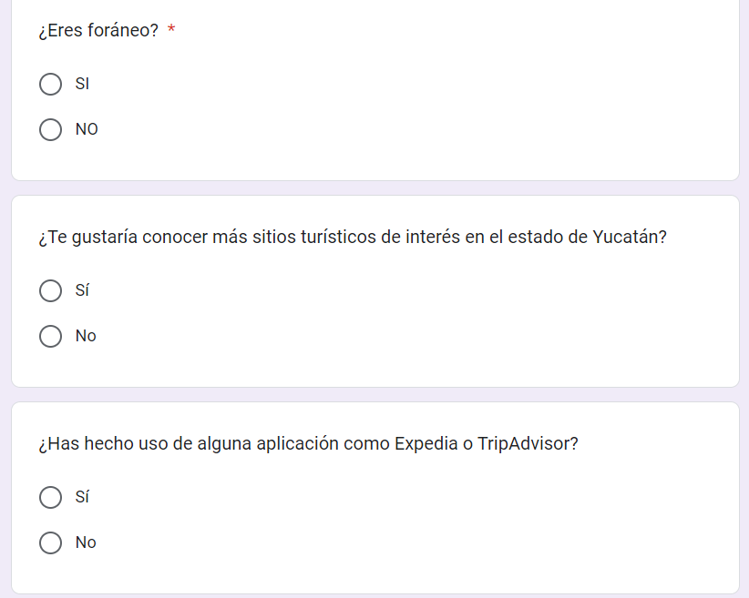
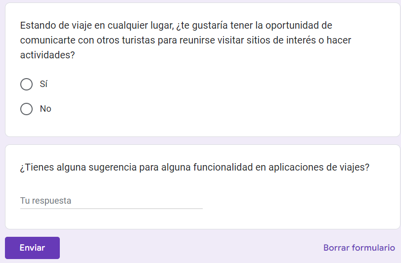

## Refinement of artifacts

Throughout the deliveries we noticed some important bugs that could not be implemented for security, usability and functionality reasons for the users. On the contrary, some were changed to be more useful in the context of the user. 

At the beginning of the project we had in mind that there are three types of users, among these were tourists, tour guides and locals, taking into account this, one of the functional requirements that were discarded along the way was the option to find tour guides, and therefore the idea that tour guides can be promoted in our application was also eliminated. We also opted to delete the requirement that locals could offer to accompany tourists in more everyday activities. At the end, of the 3 types of users only one remained, which would be all the tourists that use the app, these now are not looking for tour guides or locals of the place they visit, but they are looking for other tourists who want to do tourist activities together. To improve a requirement, use cases were used to help justify the changes, vulnerabilities were avoided with permissions so that users have greater security when using the location, messaging and user functions. The use of data within the tourist profile information was improved, this also required a reporting and blocking system as well as one for authentication within the app. 

A resource we used to find out what a tourist really wants and thus be able to better define the requirements, was to use the Google Forms tool to conduct a survey, which served as a guide throughout the project.

 
